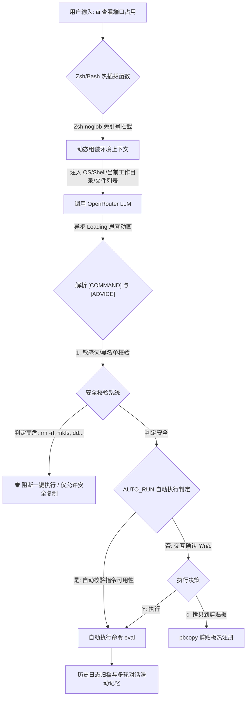

# 🛡️ ShellAI - 极简、安全且防弹的 AI 命令行助手

[](https://opensource.org/licenses/MIT)
[]()
[]()

> **💡 让 AI 成为你终端的第二大脑。**  
> `ShellAI` 是一个极其纯粹、超轻量且无依赖的单文件终端命令查询与原地执行助手。它不仅能将你的自然语言转化为 100% 精准的终端指令，更配备了**军工防弹级安全审计系统**，在本地对高危命令进行微秒级主动式拦截，为你的系统安全保驾护航。

---

## 🚀 核心架构与运行流程



---

## ✨ 核心亮点特性

### 1. 🛡️ 军工防弹级安全拦截（本地微秒级校验）
大模型难免产生幻觉，误生成毁灭性指令。`ShellAI` 在本地内置了极速的纯 Shell 通配符判别模块：
* **无死角防删**：自动感知并拦截一切形式包含 `-r` / `-f` 且涉及 `*`、隐藏文件、`.git` 等高危位置的 `rm` 或其他删除动作。
* **磁盘与物理保护**：彻底阻断物理分区、格式化（`mkfs`, `fdisk`, `parted`）、`dd` 物理写盘、敏感内核重置（`chmod -R /`）及 Fork 炸弹等。
* **物理防呆**：高危命令自动剥离一键运行权限，只允许取消或在复制前经过**二次净化**（例如在复制到剪贴板时，自动剃除对 `.git` 的非安全包含）。

### 2. ⚡ noglob 免引号完美输入（仅 Zsh 专享）
在常规的 shell 工具中，如果你输入包含通配符的自然语言（如 `ai 怎么查找 *.json 文件`），Zsh 会直接在终端抛出 `zsh: no matches found` 错误中断。
* `ShellAI` 利用 `noglob` 别名对全局命令实施了热插拔式拦截，**无需加任何引号**即可在终端自由书写任意特殊字符。

### 3. 💬 跨进程多轮对话与滑动记忆
支持基于当前终端上下文的多轮问答：
* 例如首轮输入：`ai 怎么查找当前目录下最大的三个文件`
* 紧接着追问：`刚才那个命令，只显示文件名怎么改`
* 脚本将在本地 `~/.shell_ai/session.json` 中自动维系 10 轮交互历史，且实施自动滑动淘汰，完美还原沉浸式对话体验。

### 4. 🌀 极客级转圈思考动画与 UI
* **防闪烁光标**：在等待 API 响应时，利用后台异步控制自动隐藏终端物理光标，输出时平滑恢复。
* **现代色板**：全面引入 ANSI 精美 Harmony 调色板，告别单调的终端黑白，极具现代质感。

---

## 🛠️ 安装与快速配置

### 🚀 方式一：极速一键安装（推荐）
直接复制并运行以下一行命令，即可全自动完成**核心脚本下载**、**系统全局别名部署**与**终端自启静默载入**：

```bash
# 使用 curl 一键无缝安装
curl -fsSL https://raw.githubusercontent.com/xueliangGit/shell-ai/main/ai.sh -o ~/.ai.sh && chmod +x ~/.ai.sh && ~/.ai.sh install
```

或者（如果您的环境没有安装 `curl`）：

```bash
# 使用 wget 一键安装
wget -qO ~/.ai.sh https://raw.githubusercontent.com/xueliangGit/shell-ai/main/ai.sh && chmod +x ~/.ai.sh && ~/.ai.sh install
```

> **💡 一键安装会为您自动做些什么？**
> 1. 下载 `ai.sh` 核心控制脚本并安全静默保存在您的家目录下（即 `~/.ai.sh`）。
> 2. 创建极速全局软链接 `~/.local/bin/ai`，将 `ai` 注册为系统全局命令。
> 3. 自动识别您的终端环境（Zsh 或 Bash），在 `~/.zshrc` 或 `~/.bash_profile` 末尾追加初始化逻辑，**此后您新开任意终端即可直接使用 `ai` 命令！**

---

### 📦 方式二：手动克隆与本地开发部署（备选）
如果您需要对源码进行修改或本地调试开发，请采用以下步骤：

1. **克隆项目并移动**：
   ```bash
   git clone git@github.com:xueliangGit/shell-ai.git
   cd shell-ai
   # 移动到家目录以完美对齐内置全局软链接路径
   cp ai.sh ~/.ai.sh && chmod +x ~/.ai.sh
   ```

2. **本地执行安装**：
   ```bash
   ~/.ai.sh install
   ```

---

### 🔑 首次激活：配置 API 密钥
在您完成上述任意一种安装后，在终端中直接运行以下命令，即可启动高颜值命令行配置向导：
```bash
ai config
```
按照提示输入您的 OpenRouter Key（支持切换任意大模型，包含免费或极低成本模型），验证通过后即可永久启用！

---

## 📖 极客命令指南

除了直接输入自然语言进行查询外，`ShellAI` 还配备了一套优雅、功能齐备的极客命令行管理指令集：

| 指令 | 作用 | 示例 |
| :--- | :--- | :--- |
| `ai <问题内容>` | **核心功能**：智能解析需求，生成并交互运行终端命令 | `ai 查出占用 8080 端口的进程` |
| `ai config` | 启动图形化命令行配置向导，支持验证 API 可用性 | `ai config` |
| `ai status` | 查看当前配置（API 密钥已进行防泄露脱敏处理） | `ai status` |
| `ai model <id>` | 在线验证并永久切换底座模型（如 `google/gemini-2.5-flash`） | `ai model google/gemini-2.5-pro` |
| `ai auto [on/off]` | 🚀 开启/关闭无危命令的一键免确认自动执行 | `ai auto on` |
| `ai history` | 显示最近 15 次的历史提问与命令生成列表 | `ai history` |
| `ai history <序号>` | **一键复用**：提取对应序号的历史命令，支持重新运行或拷贝 | `ai history 3` |
| `ai analyze` | 🛡️ **终端深度审计**：调遣 AI 安全专家深度审计你最近的终端历史指令 | `ai analyze` |
| `ai clear` / `reset` | 🧹 一键清空多轮对话的上下文记忆，开启全新的话题 | `ai clear` |
| `ai uninstall` | 🧹 **彻底卸载**：全自动清理别名、自启动载入与配置，恢复纯净系统 | `ai uninstall` |
| `ai help` | 显示极其精美的本地帮助控制台 | `ai help` |

---

## 🛡️ 安全承诺与设计原则
`ShellAI` 秉持“本地绝对可控，行为完全诚实”的设计理念：
1. **0% 外部依赖**：仅依靠系统自带的 `curl` 和 `jq` 运行，无需通过复杂的 node_modules / pip 等大型三方包，杜绝供应链投毒。
2. **密钥绝对本地化**：你的 API 密钥仅明文保存在你本机的物理路径 `~/.shell_ai/config` 下，绝不会被传输到任何三方服务器。
3. **安全拦截不强求**：当拦截高危敏感词后，我们绝不会生硬地拒绝操作，而是将精简净化后的安全指令呈送剪贴板，由作为系统管理员的你亲自把关手动执行。

---

## 📄 开源协议
本项目采用 [MIT 协议](LICENSE) 开源，欢迎提交 Issue 和 PR 共同打磨这款极致纯粹的终端黑科技！
